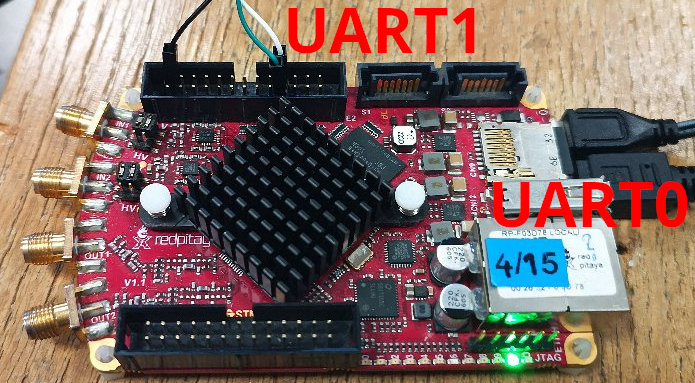
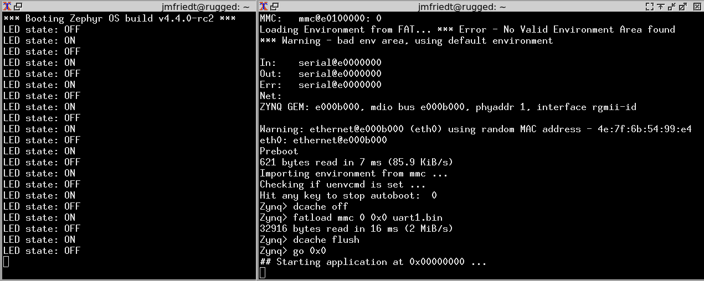

# ZephyrOS on the Zynq 7010 of the Red Pitaya

Dependencies on Debian GNU/Linux
```
sudo apt install golang-github-invopop-jsonschema-dev python3-jsonschema device-tree-compiler ninja-build python3-pyelftools
```

## Patching Zephyr for the Red Pitaya

<a href="https://zephyrproject.org/">ZephyrOS</a> supports the Zybo, a <a href="https://digilent.com/reference/programmable-logic/zybo-z7/reference-manual">Zynq-based evaluation board</a>. According
to the pinout, its bank 0/pin 7 is connected to LED4, which also happens to
be the red PS-accessible MIO pin on the Red Pitaya. Hence, the devicetree
entry ``zephyr/boards/digilent/zybo/zybo.dts`` stating 
```
gpios = <&psgpio_bank0 7 GPIO_ACTIVE_HIGH>;
```
remains valid.

However, the Zybo communicates over UART1 whereas the USB-microB port is
connected to UART0 of the Zynq on the Red Pitaya. Gwenhael Goavec-Merou
provides the <a href="zephyr_redpit.patch">following patch</a> to change
the communication port: apply with ``patch -p1 < zephyr_redpit.patch`` from
the ``zephyr`` directory.

## Compiling ZephyrOS on the Red Pitaya

ZephyrOS ~~annoyingly fetches all BSPs~~ only fetches the necessary CMSIS
library needed for this demonstration when installing with
```
pip install west --break-system-packages
west init
west update cmsis # DO NOT "west update" which will download 9 GB of useless BSPs
```
so at least we save a bit of space by using the distribution (Debian) provided
cross-compiler instead of the one provided by ZephyrOS. At the end of
``zephyr-env.sh`` we add
```
export ZEPHYR_TOOLCHAIN_VARIANT=cross-compile
export CROSS_COMPILE=/usr/bin/arm-none-eabi-
```
to use the compiler provided by the ``gcc-arm-none-eabi``. Whenever ZephyrOS
is to be used, source this configuration file with
``source zephyr-env.sh``.

## Running ZephyrOS on the Red Pitaya

Assuming a <a href="https://github.com/trabucayre/redpitaya">Buildroot</a> SD
card for the Red Pitaya is available which already provides U-Boot support avoids
having to generate a ``ps7_init`` startup file, then compile the Zephyr blinking LED example with
```
west build -b zybo  samples/basic/blinky
```
and copy the resulting ``cp build/zephyr/zephyr.bin /mnt/zephyr.bin``
on the first partition of the SD card.

Launch the Red Pitaya and stop the automatic boot sequence of U-Boot, then type
```
dcache off
fatload mmc 0 0x0 zephyr.bin
dcache flush
go 0x0
```
to launch the program. The terminal will display
```
Importing environment from mmc ...
Checking if uenvcmd is set ...
Hit any key to stop autoboot:  0
Zynq> dcache off
Zynq> fatload mmc 0 0x0 zephyr.bin
41120 bytes read in 25 ms (1.6 MiB/s)
Zynq> dcache flush
Zynq> go 0x0
## Starting application at 0x00000000 ...                    
*** Booting Zephyr OS build 1b23efc6121e ***                 
LED state: OFF
LED state: ON
LED state: OFF
LED state: ON
LED state: OFF
LED state: ON
LED state: OFF
...
```
and the red LED will be blinking.

## Dining philosopher solution

As described at https://github.com/zephyrproject-rtos/zephyr/tree/main/samples/philosophers, the use
of the ZephyrOS scheduler for solving the dining philosophers is demonstrated with
```
west build --pristine -b zybo samples/philosophers/
```
but despite compiling with the proposed minimal ZephyrOS updates, the successful execution requires
```
west update
```
to download all (9 GB) modules: I have not identified which module is needed
(``west update cmsis_6 openthread picolibc`` is not enough). Upon execution:
```
Philosopher 0 [P: 3]        STARVING
Philosopher 1 [P: 2]  THINKING [  325 ms ]
Philosopher 2 [P: 1]  THINKING [  325 ms ]
Philosopher 3 [P: 0]   EATING  [  725 ms ]
Philosopher 4 [C:-1]  THINKING [  100 ms ]
Philosopher 5 [C:-2]   EATING  [  275 ms ]
```

**TODO: identify which packages are mandatory to obtain a functional executable (and not just being able
to compile a binary that will not execute)**

Note:
```
west build --pristine -b zybo samples/philosophers/
```
does not require write access to the directory in which ZephyrOS is stored since the ``build`` output is
generated in the working directory.

## Running on CPU1

When launching the Zybo binary generated with the unmodified ZephyrOS communicating over UART1,
then an additional UART to USB converted is used:



with two ``minicom`` showing access to the UART0 (U-Boot stopped, right) and running Zephyr (left).



However, both are still running on the same core CPU0, so that U-Boot has been stopped by the
execution of ZephyrOS. The objective is to execute ZephyrOS on CPU1 instead of CPU0 so that
the latter is free to execute Linux.

Abderraouf Messaoudi proposes to load the Zephyr binary and overwrite the first opcodes
(probably where the reset handler and software interrupt vector are located) with the SEV 
instruction to wakeup CPU1 after loading the program to an address space
allocated to this CPU and leaving enough space for Linux:

```
dcache off
fatload mmc 0 0x10000000 zephyr.bin
dcache flush
mw.l 0xFFFFFFF0 0x10000000
mw.l 0x03000000 0xE320F004
mw.l 0x03000004 0xE12FFF1E
dcache flush
go 0x03000000
```

where 0xFFFFFFF0 holds the address of the first instruction executed by CPU1 (i.e. beginning
of ``zephyr.bin``, see <a href="https://docs.amd.com/v/u/en-US/xapp1079-amp-bare-metal-cortex-a9">XAPP1079</a> and <a href="https://docs.amd.com/r/en-US/ug585-zynq-7000-SoC-TRM/Device-Security-Module">UG585"</a> on the procedure for starting CPU1), while the opcodes stored in any location
in a lower memory address range (here 0x03000000) are disassembled as
```
E3 20 F0 04    sev
E1 2F FF 1E    bx  lr
```
in order to wakeup CPU1 and jump to its program execution while telling U-boot it has returned.

The matching ZephyrOS configuration requires defining the allocated memory region to the
same space, so that Zephyr's devicetree in ``boards/digilent/zybo/zybo.dts`` replaces 
the ``sram0`` node with
```
sram0: memory@10000000 {
compatible = "mmio-sram";
reg = <0x10000000 0x2000000>;
};
```
For the dining philosophers problem enable ``CONFIG_STDOUT_CONSOLE=y`` in 
``samples/philosophers/prj.conf``.

This will execute ZephyrOS on CPU1 as demonstrated with the prompt of U-Boot still
active on CPU0. 

## Running ZephyrOS on CPU1 and Linux on CPU0 (no working, in progress...)

Loading Linux with
```
setenv bootargs 'console=ttyPS0,115200 root=/dev/mmcblk0p2 rw rootwait earlyprintk maxcpus=1 mem=206M'
fatload mmc 0 0x2080000 zImage
fatload mmc 0 0x2000000 system.dtb
bootz 0x2080000 - 0x2000000
```
might overwrite some of the peripheral settings, and most importantly the entry
```
serial@e0001000 {
  compatible = "xlnx,xuartps", "cdns,uart-r1p8";
  status = "disabled";
  clocks = <0x01 0x18 0x01 0x29>;
  clock-names = "uart_clk", "pclk";
  reg = <0xe0001000 0x1000>;
  interrupts = <0x00 0x32 0x04>;
  phandle = <0x20>;
};
```
in the Red Pitaya devicetree disables UART1. Also, CPU1 might be reinitialized, but even commenting
out the ``cpu1`` node in the devicetree stops Zephyr from executing on CPU1.

**To be continued...: check if CPU1 is reinitialized, UART (might not be because even on UART0 Zephyr
stops running, but restarts randomly after some time), or MMU/cache issue. ``devmem 0x10000000 32`` 
demonstrates that the memory region was not overwritten.**
